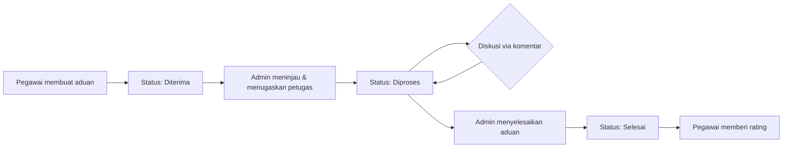
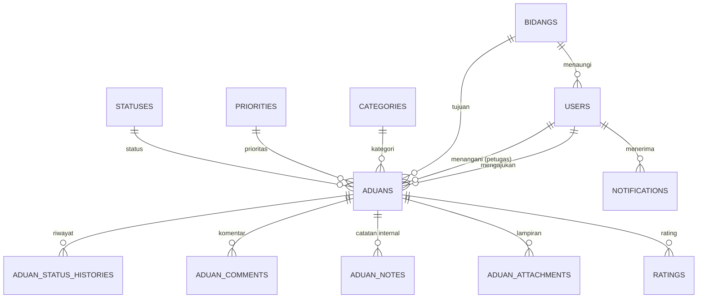

<p align="center">
  
</p>

<h3 align="center">Sistem Informasi Helpdesk Aduan Terintegrasi Internal</h3>

<p align="center">
  Platform helpdesk digital untuk pengelolaan aduan internal<br>
  <strong>Badan Pengelolaan Pendapatan, Keuangan dan Aset Daerah (BPPKAD) GRESIK</strong>
</p>

<p align="center">
  
  
  
  
  
</p>

<p align="center">
  <a href="#tentang-sihati">Tentang</a> •
  <a href="#fitur-utama">Fitur</a> •
  <a href="#teknologi">Teknologi</a> •
  <a href="#instalasi">Instalasi</a> •
  <a href="#struktur-proyek">Struktur</a> •
  <a href="#kontribusi">Kontribusi</a>
</p>

---

## Tentang SIHATI

**SIHATI** (Sistem Informasi Helpdesk Aduan Terintegrasi Internal) adalah aplikasi web internal yang dikembangkan untuk **Badan Pengelolaan Pendapatan, Keuangan dan Aset Daerah (BPPKAD) GRESIK** guna menyederhanakan proses pelaporan, penanganan, dan pemantauan aduan/keluhan pegawai secara terpusat.

Sebelumnya, pelaporan kendala internal (fasilitas, sistem, administrasi, dan layanan pendukung lainnya) dilakukan secara manual dan tersebar di berbagai kanal komunikasi, sehingga sulit dipantau dan tidak terdokumentasi dengan baik. SIHATI hadir sebagai satu pintu terpusat: pegawai dapat mengajukan aduan dengan mudah, sementara admin dapat mengelola, menindaklanjuti, dan melacak status setiap aduan secara transparan dan akuntabel.

## Fitur Utama

### Untuk Pegawai
- Mengajukan aduan baru lengkap dengan kategori, bidang tujuan, lokasi, kontak, dan lampiran pendukung
- Memantau status aduan secara real-time melalui riwayat status (timeline)
- Berdiskusi langsung dengan admin/petugas melalui fitur komentar
- Menerima notifikasi otomatis saat status aduan berubah atau ada balasan baru
- Memberikan rating dan ulasan atas aduan yang telah selesai ditangani

### Untuk Admin
- Dashboard terpusat untuk memantau seluruh aduan yang masuk
- Mengelola status dan prioritas aduan (Diterima → Diproses → Selesai)
- Menambahkan catatan internal yang tidak terlihat oleh pelapor
- Mengelola lampiran dan berdiskusi dengan pelapor
- Menghasilkan laporan rekap aduan, mencetak (PDF), dan mengekspor data ke Excel
- Mengelola data master: pengguna, bidang/unit kerja, kategori, prioritas, dan status
- Melacak seluruh aktivitas penting melalui log audit

### Pengalaman Pengguna
- **Notifikasi in-app** dengan indikator belum dibaca
- **Live update tanpa reload** — komentar baru, perubahan status, dan badge prioritas pada halaman detail aduan diperbarui otomatis secara berkala

## Peran Pengguna

| Peran | Hak Akses |
|:--|:--|
| **Pegawai** | Mengajukan aduan, memantau status, berdiskusi, dan memberi rating atas aduan miliknya sendiri |
| **Admin** | Mengelola seluruh aduan yang masuk, data master sistem, laporan, dan log aktivitas |

Akses tiap halaman dikendalikan melalui middleware berbasis peran (`role:admin` / `role:pegawai`).

## Alur Kerja Aduan



Setiap perubahan status tercatat sebagai riwayat (audit trail) yang dapat ditelusuri kapan pun melalui halaman detail aduan.

## Teknologi

| Kategori | Teknologi |
|:--|:--|
| Backend Framework | [Laravel 13](https://laravel.com) (PHP 8.3+) |
| Autentikasi | Laravel Breeze |
| Frontend | Blade Templating, [Tailwind CSS 4](https://tailwindcss.com), Alpine.js |
| Build Tool | Vite |
| Database | SQLite *(default)* — kompatibel dengan MySQL/PostgreSQL |
| Ekspor Dokumen | `barryvdh/laravel-dompdf` (PDF), `maatwebsite/excel` (Excel) |
| Pembaruan Real-time | Polling berbasis Fetch API (vanilla JavaScript) |

## Struktur Data

Entitas inti dalam basis data SIHATI:



## Instalasi

### Prasyarat

- PHP >= 8.3
- Composer
- Node.js & npm

### Langkah-langkah

```bash
# 1. Clone repository
git clone https://github.com/NAUFALMAULANARAFIQ/SIHATI.git
cd SIHATI

# 2. Instal dependensi PHP
composer install

# 3. Instal dependensi frontend
npm install

# 4. Siapkan file environment
cp .env.example .env
php artisan key:generate

# 5. Siapkan basis data (default: SQLite)
touch database/database.sqlite
php artisan migrate --seed

# 6. Jalankan aplikasi (server + build asset sekaligus)
composer run dev
```

Aplikasi dapat diakses melalui `http://localhost:8000`.

> **Catatan:** Untuk menggunakan MySQL/PostgreSQL, sesuaikan variabel `DB_*` pada file `.env` sebelum menjalankan perintah migrasi.

## Struktur Proyek

```
app/
├── Http/Controllers/
│   ├── Admin/            # Controller khusus peran admin
│   └── Pegawai/          # Controller khusus peran pegawai
├── Models/                # Aduan, User, Status, Priority, Notification, dll.
└── services/              # Logika bisnis (AduanService, AduanStatusService, NotificationService, dll.)

resources/views/
├── admin/                  # Tampilan untuk admin
├── pegawai/                # Tampilan untuk pegawai
└── partials/                # Komponen tampilan bersama

routes/
└── web.php                 # Seluruh definisi routing aplikasi
```

## Kontribusi

Proyek ini dikembangkan dan dikelola untuk kebutuhan internal BPPKAD GRESIK. Kontribusi dari anggota tim pengembang dapat dilakukan dengan alur berikut:

1. Buat *branch* baru dari `main`/`naufal` dengan nama deskriptif (mis. `fix/notifikasi-komentar`)
2. Lakukan perubahan dan pastikan tidak merusak fitur yang sudah berjalan
3. Ajukan *pull request* dengan deskripsi perubahan yang jelas
4. Tunggu peninjauan sebelum digabungkan ke branch utama

## Lisensi

Perangkat lunak ini dikembangkan khusus untuk keperluan internal **Badan Pengelolaan Pendapatan, Keuangan dan Aset Daerah (BPPKAD) GRESIK** dan tidak didistribusikan sebagai perangkat lunak sumber terbuka (*open source*). Seluruh hak penggunaan tunduk pada kebijakan internal instansi terkait.

---

<p align="center">
  Dibangun dengan Laravel untuk mendukung pelayanan internal yang lebih responsif dan transparan.
</p>
